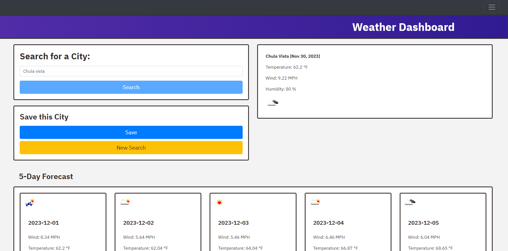

# Work-day Scheduler(9am-5pm)

## Description
This project is intended to display that the Developer can perform API fetches and handle data returned from API fetch.
Furthermore, this project demonstrates the use of a CSS framework for page styling.

# Completed Website page:

## Installation

Files are available for download through Git Hub:
(https://github.com/Dev-Attaway/weather-app)
## Usage

To be used as a model for how a fetch operation is performed, while other weather apps are more robust in their function.
This app can be used to tell you the weather within any city in America

## Credits

Developer:
https://github.com/Dev-Attaway

Source code:

The webpage can be viewed through this link:
(https://dev-attaway.github.io/weather-app/)
## License

Please take a look at the LICENSE in the repo.
